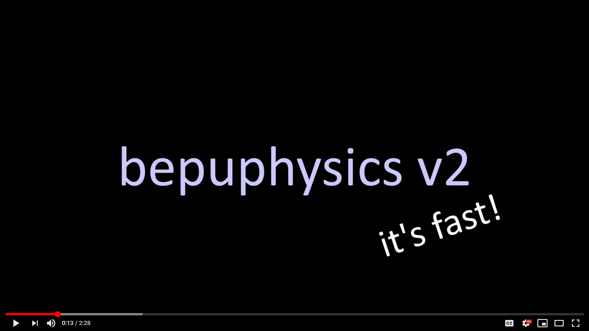

# bepuphysics v2

This is the repo for the bepuphysics v2 library, a complete rewrite of the C# 3d rigid body physics engine [BEPUphysics v1](https://github.com/bepu/bepuphysics1).

The BepuPhysics and BepuUtilities libraries target .NET 6 and should work on any supported platform. The demos application, Demos.sln, uses DX11 by default. There is also a Demos.GL.sln that uses OpenGL and should run on other platforms. The demos can be run from the command line (in the repo root directory) with `dotnet run --project Demos/Demos.csproj -c Release` or `dotnet run --project Demos.GL/Demos.csproj -c Release`.

The physics engine heavily uses `System.Numerics.Vectors` types, so to get good performance, you'll need a compiler which can consume those types (like RyuJIT).

To build the source, you'll need a recent version of Visual Studio with the .NET desktop development workload installed. Demos.sln references all relevant projects. For more information, see [Building](Documentation/Building.md).

## Features

- Spheres, capsules, boxes, triangles, cylinders, and convex hulls
- Compounds of the above
- Meshes
- A [whole bunch of constraint types](BepuPhysics/Constraints/)
- [Newts](Demos/Demos/NewtDemo.cs)
- Linear and angular continuous collision detection
- Extremely low cost sleep states for resting bodies
- Efficient scene-wide ray and sweep queries
- [Character controller example](Demos/Demos/Characters/CharacterDemo.cs)
- At least somewhat extensible collision pipeline, with [example custom voxel collidable](Demos/Demos/CustomVoxelCollidableDemo.cs)
- Highly nonidiomatic APIs
- Super speediness
- And a bunch of other miscellaneous stuff!

## Links

Report bugs [on the issues tab](../../issues). 

Use the [discussions tab](../../discussions) for... discussions. And questions.

By user request, there's a [discord server](https://discord.gg/ssa2XpY). I'll be focusing on github for long-form content, but if you like discord, now you can discord. 

[Getting Started](Documentation/GettingStarted.md)

[Building](Documentation/Building.md)

[Q&A](Documentation/QuestionsAndAnswers.md)

[Stability Tips](Documentation/StabilityTips.md)

[Performance Tips](Documentation/PerformanceTips.md)

[Substepping](Documentation/Substepping.md)

[Continuous Collision Detection](Documentation/ContinuousCollisionDetection.md)

[Contributing](CONTRIBUTING.md)

[Change log](Documentation/changelog.md)

[Upgrading from v1, concept mapping](Documentation/UpgradingFromV1.md)

[Packaging and Versioning](Documentation/PackagingAndVersioning.md)

Check the [roadmap](Documentation/roadmap.md) for a high level look at where things are going.

If you have too many dollars, we are willing to consume them through [github sponsors](https://www.github.com/sponsors/RossNordby).

